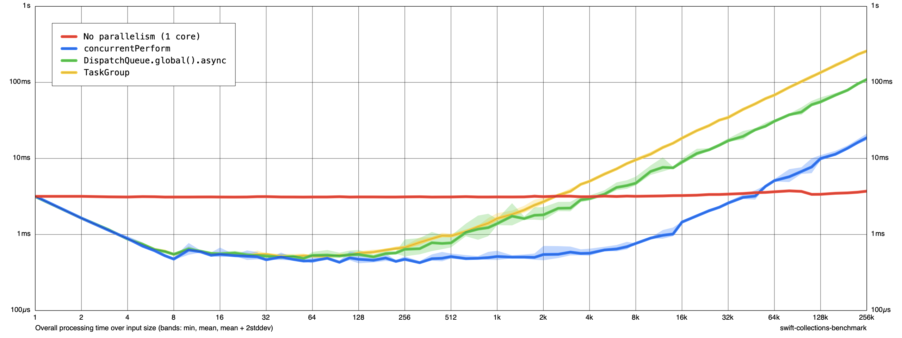

# ConcurrencyBenchmark

Benchmarks for CPU-bound computation comparing different parallelization strategies.

## Usage

Run the benchmarks:

```sh
swift run -c release benchmark run \
  --cycles 3 \
  --min-size 10 \
  --max-size 256k \
  BenchmarkData/benchmark-data.json
```

Create a chart:

```sh
swift run -c release benchmark render \
  BenchmarkData/benchmark-data.json \
  BenchmarkData/chart.png \
  --amortized false \
  && open BenchmarkData/chart.png
```

For more options:
- See the [Swift Collections Benchmark Getting Started Guide](https://github.com/apple/swift-collections-benchmark/blob/main/Documentation/01%20Getting%20Started.md)
- `swift run -c release benchmark run --help`
- `swift run -c release benchmark render --help`

## Current chart

Note: the x axis should be called "number of subtasks", not "input size":

- The benchmark always performs 10 million computations (this is [the `totalWorkload` variable](https://github.com/ole/ConcurrencyBenchmark/blob/main/Sources/BenchmarkCLI/Main.swift#L5) in the code)
- If "input size" = 10, the workload is split into 10 "subtasks". E.g. we're calling `concurrentPerform` with 1 million iterations, where each iteration perform 10 million / 10 = 1 million computations. Same for the `TaskGroup` (10 child tasks) and `DispatchQueue.global.async()` (10 work items passed to the global queue).
- For large input sizes, this creates a very large number of subtasks with each subtask doing very little work. This is why the curves go up as the number of subtasks increases.
- The "No parallelism (1 core)" task always performs the same number of computations, regardless of input size. This is why the line is flat.
- We're passing `--amortized false` when rendering the chart to show the total elapsed time. Without this, the chart would depict the time per "subtask", which is meaningless to us because the amount of work per subtask isn't constant. 

This chart was created on an Apple M1 Pro (10 cores):


